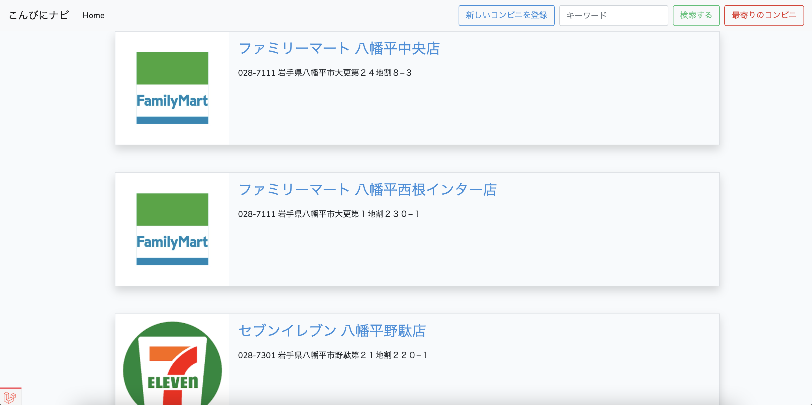
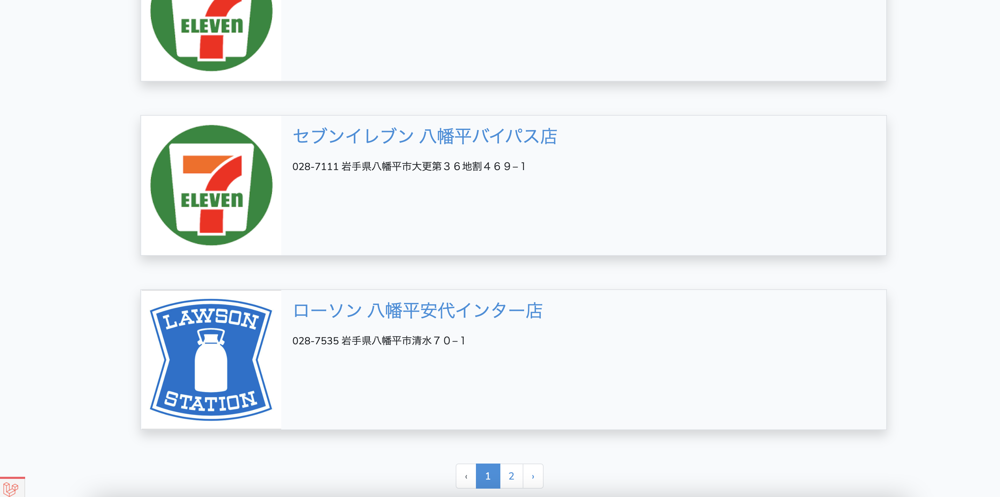
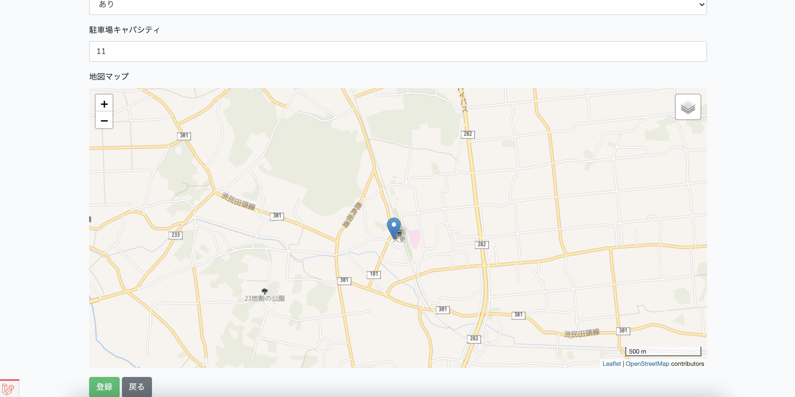
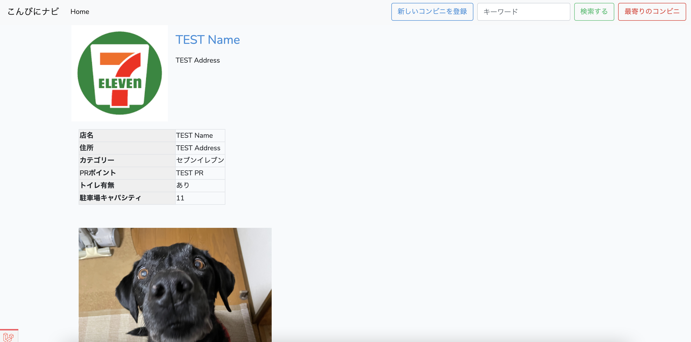
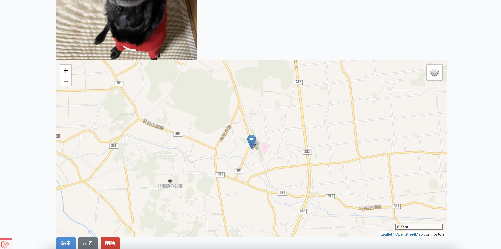
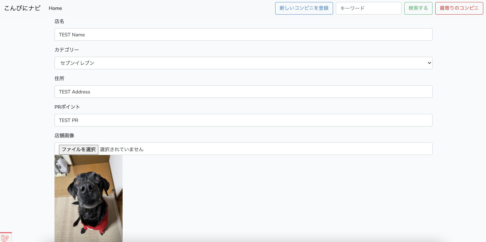
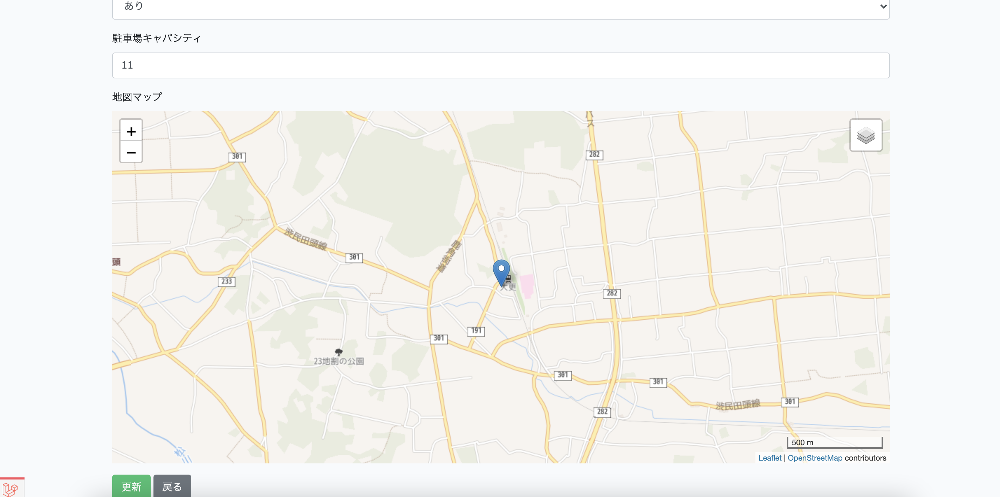
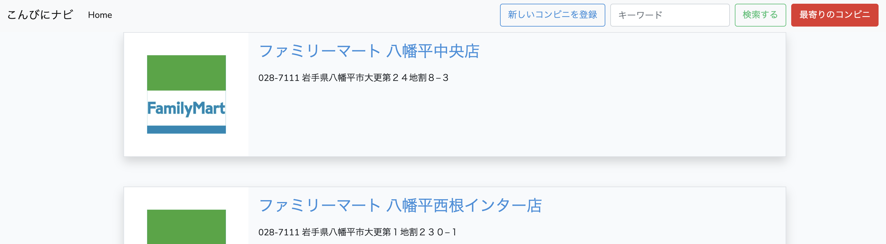
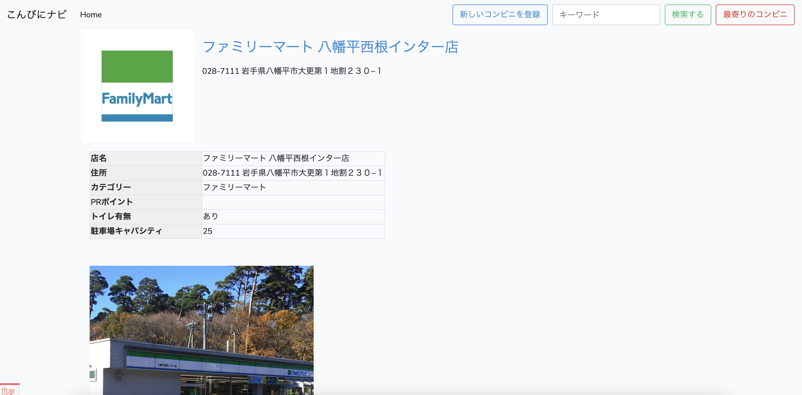

# こんびにナビ

## About This App
* コンビニを気軽にCRUDできるアプリ
* 八幡平のコンビニがどこにあるかわかったらいいなと思い作りました
* 初期データとして、八幡平のコンビニをSeederで登録しています

## テーブル定義
* コンビニカテゴリtable・・・セブンやファミマなどのコンビニのカテゴリ情報を格納
* コンビニ店舗table・・・各店舗の情報を格納、コンビニカテゴリtableへの外部キーあり
https://docs.google.com/spreadsheets/d/1H_1_2NfZD-ILBi5e1RKQRcrrv0jm1zurL-JM_3A-hpQ/edit?usp=sharing

## 実装機能
* CRUD
  * 各コンビニの店舗がCRUDできるようになっています
  * バリデーションも実装済
* 検索
  * フリーキワードから、検索できるようになってます
  * 入力したキーワードが、「店名」か「住所」か「PRポイント」か「カテゴリ名」に含まれているかで検索
* ファイルアップロード
  * コンビニ店舗の画像は、ファイルアップロードできるようにしました
  * ファイルアップロードするとき、画面上にプレビュー画像が表示されるようにしました
  * アップロードした画像は、/storage/app/public/images配下に保存
* Map
  * 各店舗の位置情報は、Mapをプロットした情報で登録できるようにしました

## プラスαで工夫した点
* 「最寄りのコンビニ」ボタン
  * 押すと、現在地から最寄りのコンビニを探し、その詳細画面へ遷移
  * 現在地の緯度経度を、geolocationで取得
  * 現在地と登録されている店舗の緯度経度との距離を、APIを使って計算
  * 最も距離が近い店舗情報から、詳細画面を表示
  * APIの仕様で、レスポンスが悪いです

## 画面

### 一覧画面





### 登録画面




### 詳細画面





### 編集画面





### 最寄りのコンビニ
「最寄りのコンビニ」ボタンを押すと、、

現在地から検索した「最寄りのコンビニ」の詳細画面を表示


## 環境構築

```
$ git clone git@github.com:kbanchi1111/kbanchi1111-convenience-store-navi.git
$ cd kbanchi1111-convenience-store-navi
$ git switch feature
$ docker run --rm \
  -v $(pwd):/opt \
  -w /opt \
  laravelsail/php80-composer:latest \
  bash -c "composer install"
$ cp .env.example .env
$ sail up -d
$ sail artisan key:generate
$ sail artisan migrate:fresh --seed
$ sail artisan storage:link
$ unzip init_images.zip
$ cp -r images storage/app/public/
```